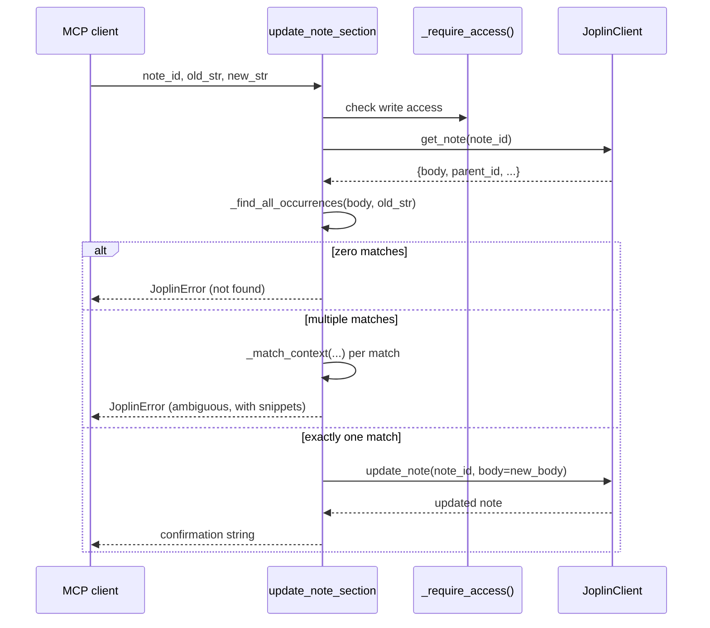

# Design: Safe partial-edit tools for notes

Source: [requirements.md](./requirements.md) · [GitHub issue #47](https://github.com/johnsarie27/joplin-mcp/issues/47)

## Approach / overview

Add two new `@mcp.tool` functions to `server.py` — `update_note_section` and
`append_note_section` — that each read the current note body via the
existing `client.get_note()`, compute a new body in Python, and write it
back via the existing `client.update_note(note_id, body=...)`. No changes
to `client.py` or the Joplin REST layer are needed: both new tools are
built entirely from operations the client already exposes. Access control
reuses the exact `_require_access()` / `can_write()` pattern already used
by `update_note`, `delete_note`, and `complete_todo`.

Matching/appending logic is implemented as two small, pure helper
functions (no I/O), so they're unit-testable without the fake client:

- `_find_all_occurrences(body: str, old_str: str) -> list[int]` — returns
  the start index of every non-overlapping occurrence of `old_str` in
  `body` (same non-overlapping semantics as `str.count`).
- `_match_context(body: str, index: int, length: int, radius: int = 40) -> str`
  — returns a `...`-bounded snippet of up to `radius` characters on each
  side of one match, with embedded newlines escaped to `\n` so each
  snippet stays on one line in the error message.
- `_append_with_separator(body: str, content: str) -> str` — returns
  `content` unchanged if `body` is empty; returns `body + content`
  unchanged if `body` already ends with `"\n\n"`; otherwise returns
  `body.rstrip("\n") + "\n\n" + content`. This normalizes any amount of
  existing trailing whitespace-newlines to exactly one blank line before
  the appended content, which is a simplification of the requirement's
  "\n\n unless it already ends in one" wording chosen to avoid producing
  3+ newlines when the body ends in a single `\n`.

## Architecture

No new modules, classes, or client methods. Two new tool functions sit
alongside the existing note tools in `server.py`, following the identical
shape of `update_note`:

`append_note_section` follows the same shape minus the matching branch:
`get_note` → `_append_with_separator` → `update_note(body=...)`.

## Affected files / modules

- `src/joplin_mcp/server.py`
  - Add `_find_all_occurrences`, `_match_context`, `_append_with_separator`
    helpers.
  - Add `update_note_section` and `append_note_section` tools (registered
    with `@mcp.tool`, positioned directly after `update_note`).
  - Update `update_note`'s docstring to state that `body` replaces the
    entire note and point to the two new tools for partial edits.
- `tests/conftest.py`
  - Add `update_note` to `FakeJoplinClient` (currently absent — no tool
    calls `client.update_note` in tests today) so the new tools' write path
    can be asserted the same way `create_note`'s is.
- `tests/test_tools.py`
  - New tests for `update_note_section`: single match replaces correctly,
    zero matches raises `JoplinError` with no client write recorded,
    multiple matches raises `JoplinError` (with snippets) with no client
    write recorded, write-access is enforced via `NotebookAccessError`.
  - New tests for `append_note_section`: appends with separator on a
    non-empty body, appends with no extra separator when body already ends
    in a blank line, appends directly when body is empty, write-access is
    enforced.
- `README.md` (if it documents the tool list) — add the two new tools.

## Alternatives considered

- **Regex or diff/patch-based editing** (e.g. accepting a unified diff).
  Rejected: far more surface area for ambiguous or partially-applied edits,
  and the issue explicitly asks for a simple exact-match replace pattern.
  Out of scope per requirements.
- **Multi-edit batching** (a list of old_str/new_str pairs applied
  atomically). Rejected for this pass: adds API surface and partial-failure
  semantics (what happens if edit 3 of 5 doesn't match?) not requested by
  the issue; can be layered on later without breaking the single-edit tool.
- **Adding a dedicated `client.update_note_section()` method** that does
  the read-modify-write inside `JoplinClient`. Rejected: `JoplinClient` is
  currently a thin REST wrapper with no cross-request logic; the
  read-then-write orchestration and access checks already live in the
  server layer for every other tool (see `update_note`, `delete_note`), so
  keeping it there matches existing conventions.
- **Raising a new exception class** (e.g. `NoMatchError`,
  `AmbiguousMatchError`) instead of reusing `JoplinError`. Rejected per
  requirements decision — `JoplinError` already serves as the generic
  "tool precondition failed" exception (see `complete_todo`'s non-todo
  check), and FastMCP surfaces any raised exception as a tool error
  regardless of its specific class, so a new class would add no behavior.

## Risks / tradeoffs

- **Read-then-write race**: between `get_note` and `update_note`, another
  client could modify the note, and the section-edit would overwrite that
  intervening change (last-write-wins). This is the same race that already
  exists in `update_note`'s title-or-body-only partial update today; not
  introduced by this change, and out of scope to fix here (would require
  Joplin-side optimistic concurrency, e.g. an `updated_time` precondition,
  which the Joplin REST API doesn't straightforwardly support).
- **Large notes and multi-match errors**: `_match_context` builds one
  snippet per match; a pathological `old_str` (e.g. a single common
  character) against a huge note could produce a large error payload.
  Mitigated by using a small fixed `radius` (40 chars) per snippet; not
  capping the *number* of snippets was a deliberate simplicity choice,
  revisit only if this proves to be a real problem in practice.
- **Empty `old_str`**: `_find_all_occurrences(body, "")` would match at
  every index and loop or return nonsensical results. Guarded explicitly:
  `update_note_section` raises `JoplinError` up front if `old_str` is
  empty, before calling the helper.

No infrastructure, deployment, or cross-cutting architectural decisions are
introduced — this is a same-process, same-module addition following an
established pattern, so no Well-Architected review or ADR is warranted.

---

Approve design, or tell me what to change.
